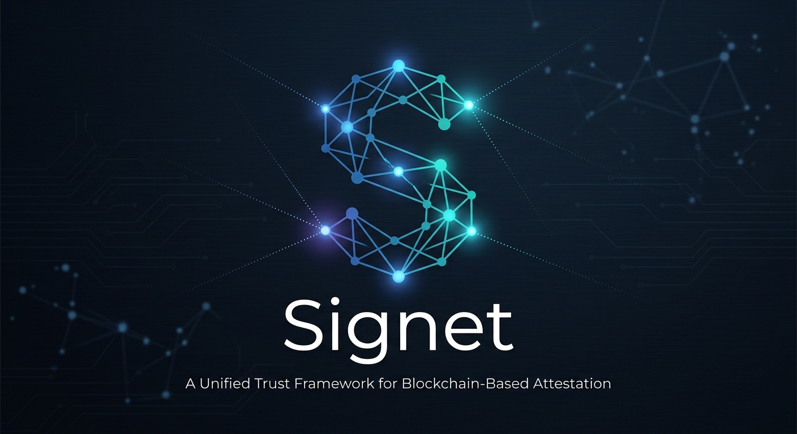

# Signet

<div align="center">



**The attestation layer for an AI-native internet — on Monad**

[](https://opensource.org/licenses/MIT)
[](https://github.com/robertocarlous/Signet/issues)

</div>

---

> Built for the Monad **Trust, Identity & AI Infrastructure** hackathon.

Signet is a permissionless **attestation protocol** on Monad: anyone registers a
schema, anyone issues cryptographically-verifiable claims (**attestations**)
about a subject, and any application can read and trust them with no API key and
no middleman. On top of the core it ships one Monad-native primitive —
**proof of personhood from a device passkey**, verified entirely on chain
through the RIP-7212 P-256 precompile.

- **Permissionless & composable** — a shared schema namespace; every credential is portable across apps.
- **Gasless** — attesters sign an EIP-712 message offline; anyone relays it and pays.
- **Not capturable** — the registries are immutable and admin-less; all policy lives in pluggable resolver contracts.
- **Passkey personhood** — one tap on existing hardware, no seed phrase, no centralised issuer.

## Live on Monad testnet (chain `10143`)

| | |
|---|---|
| **Demo** | **[signet-personhood.vercel.app](https://signet-personhood.vercel.app)** — Enrol a passkey · Verify any address · [SDK playground](https://signet-personhood.vercel.app/sdk) |
| **SDK** | `npm install @signetprotocol/evm-sdk viem` |
| **Docs** | [signet-docs.vercel.app](https://signet-docs.vercel.app) → *Monad* section |
| **Read gateway** | `GET /api/monad/*` on the horizon indexer |

### Contracts

| Contract | Address |
|---|---|
| `SignetSchemaRegistry` | [`0x2eb183fFd7D40866DEA68f2173C4C5a604D22602`](https://testnet.monadscan.com/address/0x2eb183fFd7D40866DEA68f2173C4C5a604D22602) |
| `SignetAttestationRegistry` | [`0x4A48BE178900874FF1E5c2cF91E0B56f67d5359C`](https://testnet.monadscan.com/address/0x4A48BE178900874FF1E5c2cF91E0B56f67d5359C) |
| `PasskeyAttester` | [`0x5A99835d5E7434BBf3e44Cc6A3E76b762045c48d`](https://testnet.monadscan.com/address/0x5A99835d5E7434BBf3e44Cc6A3E76b762045c48d) |
| `PersonhoodResolver` | [`0xcf5b29668EB4Ea1dC51BA596c41bb2E722425100`](https://testnet.monadscan.com/address/0xcf5b29668EB4Ea1dC51BA596c41bb2E722425100) |

Canonical machine-readable copy: [`contracts/evm/deployments.json`](contracts/evm/deployments.json).

## Core concepts

| | |
|---|---|
| **Schema** | A reusable definition string. Registering is permissionless; the registrant becomes its authority. UID is deterministic — `keccak256(abi.encode(SCHEMA_DOMAIN, keccak256(definition), authority, resolver, revocable))`. |
| **Attestation** | A signed claim about a `subject`, structured by a schema. `(schemaUID, subject, nonce)` is unique per attester; the global `uid` binds the registry address and attester so it never collides across deployments. |
| **Resolver** | An optional contract the registry calls on every attest / revoke. `onAttest` / `onRevoke` are hard gates (a `false` return or a revert blocks the op); `onResolve` is a best-effort post-hook. Fees, allowlists, and one-per-human rules live here. |
| **Delegation** | An attester signs an EIP-712 `Attest` / `Revoke` message off-chain; a relayer submits it. Replay is bounded by a per-attester nonce and a deadline. |
| **Passkey personhood** | A person proves control of a WebAuthn passkey. `PasskeyAttester` verifies the P-256 assertion on chain (RIP-7212 precompile at `0x100`) and writes a personhood attestation — one per credential, one per subject. |

## The passkey personhood flow

```
device passkey ──WebAuthn assertion──▶ PasskeyAttester.attestPersonhood(subject, x, y, auth)
                                          │  WebAuthn.verify → P256.verify  (RIP-7212 @ 0x100)
                                          │  one enrolment / credential · one attestation / subject
                                          ▼
                                       SignetAttestationRegistry.attest(...)   (attester = PasskeyAttester)
                                          │  PersonhoodResolver: reverts unless attester == PasskeyAttester
                                          ▼
                                       personhood attestation, data = abi.encode(pubKeyX, pubKeyY)
```

No seed phrase — the person proves a device passkey and anyone relays the tx.
`PasskeyAttester` / `PersonhoodResolver` are immutable and admin-less.

## Repository layout

```
contracts/
  evm/            # Solidity core for Monad (Foundry) — registries, resolvers, PasskeyAttester
  stellar/        # Original Soroban implementation (see below)
packages/
  evm-sdk/        # @signetprotocol/evm-sdk — viem SDK for Monad
  cli/            # `signet <cmd> --chain=monad|stellar`
  stellar-sdk/    # Stellar SDK
  sdk/ core/      # shared SDK abstractions
apps/
  personhood/     # Passkey personhood demo (Next.js) — deployed on Vercel
  horizon/        # Indexer (Express) — /api/monad read gateway + the Stellar indexer
  docs/           # Documentation site (Mintlify)
```

## Quickstart

Requires **Node 18+**, **pnpm**, and (for contracts) **[Foundry](https://getfoundry.sh)**.

```bash
git clone https://github.com/robertocarlous/Signet.git && cd Signet
pnpm install
pnpm build
```

### SDK

```ts
import { createPublicClient, createWalletClient, http } from 'viem'
import { privateKeyToAccount } from 'viem/accounts'
import { SignetClient } from '@signetprotocol/evm-sdk'

const transport = http('https://rpc.ankr.com/monad_testnet')
const signet = new SignetClient({
  chain: 'monadTestnet',
  publicClient: createPublicClient({ transport }),
  walletClient: createWalletClient({ account: privateKeyToAccount(process.env.PRIVATE_KEY!), transport }),
})

const { uid: schemaUID } = await signet.registerSchema({ definition: 'bool verified,string level', revocable: true })
const { uid } = await signet.attest({ schemaUID, subject: '0xSubject…', data: '0x01' })
await signet.isValid(uid) // true
```

```bash
pnpm --filter @signetprotocol/evm-sdk test      # parity tests vs live on-chain values
pnpm --filter @signetprotocol/evm-sdk example   # runnable tour (add PRIVATE_KEY for live writes)
```

### CLI

```bash
npm install -g @signetprotocol/cli

signet schema      --chain=monad --action=create --json-file=schema.json --key-file=key.txt
signet attestation --chain=monad --action=create --json-file=att.json    --key-file=key.txt
```

### Contracts

```bash
cd contracts/evm
forge test                                              # 35 tests
forge script script/Deploy.s.sol:Deploy --rpc-url monad_testnet --private-key 0x… --broadcast
```

### Demo app

```bash
cp apps/personhood/.env.example apps/personhood/.env.local   # set RELAYER_PRIVATE_KEY
pnpm --filter @signetprotocol/personhood-demo dev            # http://localhost:3002
```

## Also in this repo: Stellar

Signet began as a Soroban implementation and it still ships here —
`contracts/stellar/` (Rust), `packages/stellar-sdk`, and the Stellar side of the
`horizon` indexer. It is deployed on Stellar mainnet and testnet; addresses are
in [`contracts/stellar/bindings/src/contracts.json`](contracts/stellar/bindings/src/contracts.json).
The EVM port keeps the same data model, event shape, UID inputs, and error set so
the SDK, indexer, and docs stay chain-agnostic — the deliberate divergences are
`bytes` values instead of Soroban `String`, and EIP-712 ECDSA delegation instead
of BLS12-381.

## Tech

Solidity 0.8.28 · Foundry · OpenZeppelin (`P256`, `EIP712`, `ECDSA`) ·
viem · Next.js · Express · pnpm workspaces · Vitest / `forge test`.

## License

[MIT](./LICENSE)
