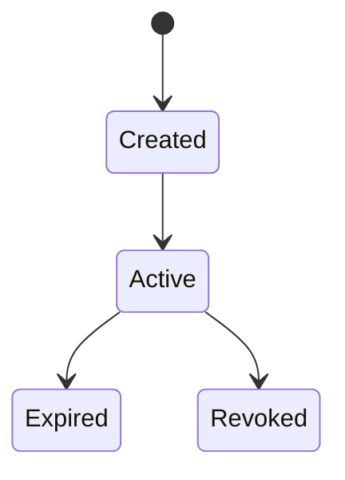

## What is an Attestation?

A signed statement by an issuer about a subject, stored on-chain.

**Example**: "KYC Provider X attests that Wallet Y is verified at level Basic"

## Attestation Properties

The fields are the same concept on every chain; only the wire format of the data
payload and a couple of names differ:

| Property | Monad (`evm-sdk`) | Stellar (`stellar-sdk`) |
|----------|--------------------|--------------------------|
| Unique identifier | `uid` (32-byte hex) | `uid` (32 bytes) |
| Reference to schema | `schemaUID` | `schemaUid` |
| Who created it | `attester` | `attester` |
| Who it's about | `subject` | `subject` |
| Attestation data | `data` — ABI-encoded `bytes`, per the schema definition | `value` — JSON string |
| When created | `time` | `timestamp` |
| When it expires | `expirationTime` (0 = never) | `expirationTime` (optional) |
| Revoked? | `revoked` | `revoked` |

## Lifecycle



**Created**: Attestation issued and stored on-chain

**Active**: Valid and queryable

**Expired**: Past expiration time (still on-chain)

**Revoked**: Explicitly invalidated by attester

## Use Cases

- **KYC/Identity**: Verify user identity
- **Credentials**: Professional certifications
- **Reputation**: On-chain reputation scores
- **Access Control**: Gate access to services
- **Compliance**: Regulatory attestations

## Schema Relationship

Every attestation references a schema that defines its structure:

<CodeGroup>
```typescript Monad
// Schema defines structure
const definition = 'bool verified,string level'

// Data is ABI-encoded to match it
import { encodeAbiParameters } from 'viem'
const data = encodeAbiParameters(
  [{ type: 'bool' }, { type: 'string' }],
  [true, 'basic'],
)
```

```typescript Stellar
// Schema defines structure
'struct KYC { bool verified; string level; }'

// Attestation follows structure
{ verified: true, level: 'basic' }
```
</CodeGroup>

## Next Steps

<CardGroup cols={2}>
  <Card title="Schemas" icon="cube" href="/concepts/schemas">
    Learn about schema design
  </Card>
  <Card title="Delegates" icon="key" href="/concepts/delegates">
    Off-chain signing — EIP-712 on Monad, BLS on Stellar
  </Card>
</CardGroup>
