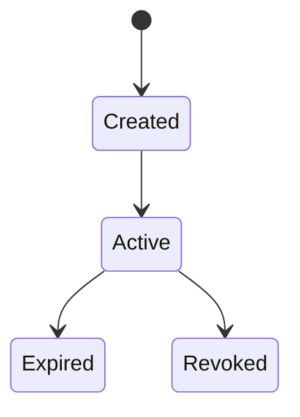

## What is an Attestation?

A signed statement by an issuer about a subject, stored on-chain.

**Example**: "KYC Provider X attests that Wallet Y is verified at level Basic"

## Attestation Properties

| Property | Description |
|----------|-------------|
| `uid` | Unique identifier (32 bytes) |
| `schemaUid` | Reference to schema structure |
| `attester` | Who created the attestation |
| `subject` | Who the attestation is about |
| `value` | Attestation data (JSON string) |
| `timestamp` | When created |
| `expirationTime` | When it expires (optional) |
| `revoked` | Whether invalidated |

## Lifecycle



**Created**: Attestation issued and stored on-chain

**Active**: Valid and queryable

**Expired**: Past expiration time (still on-chain)

**Revoked**: Explicitly invalidated by attester

## Use Cases

- **KYC/Identity**: Verify user identity
- **Credentials**: Professional certifications
- **Reputation**: On-chain reputation scores
- **Access Control**: Gate access to services
- **Compliance**: Regulatory attestations

## Schema Relationship

Every attestation references a schema that defines its structure:

```typescript
// Schema defines structure
'struct KYC { bool verified; string level; }'

// Attestation follows structure
{ verified: true, level: 'basic' }
```

## Next Steps

<CardGroup cols={2}>
  <Card title="Schemas" icon="cube" href="/concepts/schemas">
    Learn about schema design
  </Card>
  <Card title="Delegates" icon="key" href="/concepts/delegates">
    Off-chain signing with BLS keys
  </Card>
</CardGroup>
