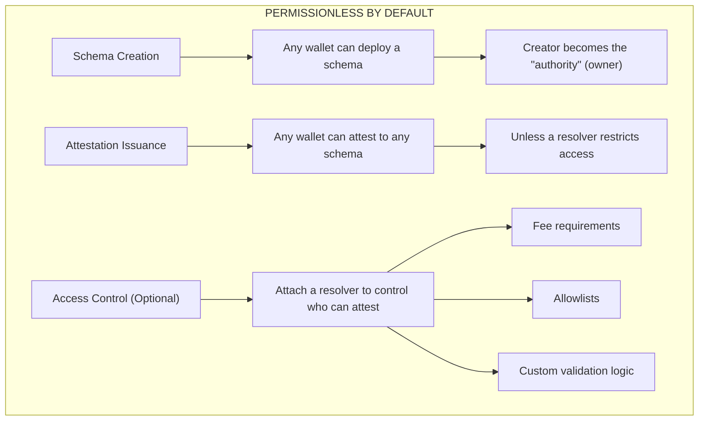

import { testnetCurrent } from "/snippets/contracts.mdx"

## What is an Authority?

In SignetProtocol, an **authority** is simply the wallet address that created a schema. When you deploy a schema, you become its authority — the permanent owner of that schema definition.

<Note>
Schemas and attestations are **permissionless by default**. Anyone can create schemas, and anyone can issue attestations to any schema — unless a resolver restricts access.
</Note>

## The Permissionless Model

SignetProtocol is designed to be open:

| Action | Default Behavior | With Resolver |
|--------|------------------|---------------|
| **Create Schema** | Anyone can create | Anyone can create |
| **Issue Attestation** | Anyone can attest to any schema | Resolver controls access |
| **Revoke Attestation** | Original attester can revoke | Resolver controls access |



## Schema Authority

When you deploy a schema, your wallet address is recorded as its **authority**. This gives you:

- **Ownership record** — Your address is permanently linked to the schema
- **Schema definition control** — You defined the structure and resolver at creation

<Warning>
Being a schema authority does **not** mean only you can attest. By default, anyone can issue attestations to your schema. Use a [resolver](/concepts/resolvers) if you need access control.
</Warning>

### Creating a Schema

```typescript
import { StellarAttestationClient } from '@signetprotocol/stellar-sdk';

const client = new StellarAttestationClient({
  network: 'testnet' // resolves to the current contract
});

// Deploy a schema - you become its authority
const schemaUid = await client.createSchema({
  definition: 'string name, bool verified, uint64 timestamp',
  resolver: null,  // No resolver = permissionless attestations
  revocable: true
});

// Anyone can now attest to this schema
```

On testnet, `network: 'testnet'` resolves to the current protocol contract, <code>{testnetCurrent}</code>. Pass `contractId` only to pin an older version.

### Restricting Access with Resolvers

If you want to control who can attest to your schema, attach a resolver:

```typescript
// Deploy a schema with access control
const schemaUid = await client.createSchema({
  definition: 'string credential, uint64 issuedAt',
  resolver: 'CRESOLVER...', // Resolver controls who can attest
  revocable: true
});

// Now only addresses approved by the resolver can attest
```

See [Resolvers](/concepts/resolvers) for details on implementing access control.

## Verified Authority (Optional)

Separately from schema authority, you can register as a **Verified Authority** on the SignetProtocol platform. This is completely optional and provides:

- **Platform badge** — Visual indicator that you're a verified issuer
- **Trust signals** — Users can see your verification status
- **Discovery** — Easier for verifiers to find trusted attestation sources

### Verification Methods

<CardGroup cols={2}>
  <Card title="stellar.toml" icon="star">
    For Stellar-native organizations, verify using your domain's stellar.toml file
  </Card>
  <Card title="DID & Verifiable Credentials" icon="fingerprint">
    Use decentralized identifiers and external credentials for verification
  </Card>
</CardGroup>

### Registering as a Verified Authority

```typescript
import { SignetProtocolAuthority } from '@signetprotocol/stellar-sdk';

// Initialize authority client
const authority = new SignetProtocolAuthority(config, authorityClient);

// Register for verified authority status (optional)
const result = await authority.registerAuthority(
  'GAUTHORITY...', // Your address
  JSON.stringify({
    name: 'Acme Verification Inc.',
    website: 'https://acme.com',
    description: 'KYC and identity verification provider'
  })
);
```

### Using the CLI

```bash
# Register for verified authority status
pnpm cli authority --chain stellar --action register --key-file ./keypair.json
```

## Authority Metadata

When registering as a verified authority, include relevant information:

```json
{
  "name": "Your Organization Name",
  "website": "https://your-domain.com",
  "description": "Brief description of what you attest to",
  "logo": "https://your-domain.com/logo.png",
  "contact": "attestations@your-domain.com",
  "categories": ["identity", "kyc", "credentials"]
}
```

## Checking Authority Status

### Check Verified Authority Status

```typescript
// Check if an address is a verified authority
const isVerified = await authority.isAuthority('GADDRESS...');

// Fetch full authority details
const authorityData = await authority.fetchAuthority('GADDRESS...');
console.log('Authority:', authorityData.data);
```

### Check Attestation Issuer

Every attestation includes the attester address:

```typescript
// Get attestation details
const attestation = await client.getAttestation(attestationUid);
console.log('Issued by:', attestation.data.attester);
```

## Delegates

Authorities can delegate attestation signing to other addresses using BLS delegation. This enables:

- **Gasless attestations** — Users sign off-chain, a relayer submits on-chain
- **Batch operations** — Issue many attestations in one transaction
- **Separation of concerns** — Keep hot wallets separate from main keys

See [Delegates](/concepts/delegates) for detailed documentation.

## Authority vs Resolver

| Concept | Purpose | Controls |
|---------|---------|----------|
| **Authority** | Schema ownership record | Who created the schema |
| **Resolver** | Access control & validation | Who can attest, fees, rules |

- **Authority** = "Who owns this schema definition"
- **Resolver** = "What rules apply when attesting"

Without a resolver, attestations are permissionless. With a resolver, you can enforce any access control logic you need.

See [Resolvers](/concepts/resolvers) for implementation details.

## Security Considerations

<Warning>
Keep your private keys secure. While attestations are permissionless, your verified authority status and any resolver admin rights are tied to your address.
</Warning>

### Best Practices

1. **Use resolvers for access control** — Don't assume only you will attest to your schema
2. **Secure your keys** — Use hardware wallets or multi-sig for production
3. **Verify your domain** — Set up stellar.toml for additional trust
4. **Monitor attestations** — Track what's being issued to your schemas

## Next Steps

<CardGroup cols={2}>
  <Card title="Resolvers" icon="code" href="/concepts/resolvers">
    Add access control to your schemas
  </Card>
  <Card title="Schemas" icon="cube" href="/concepts/schemas">
    Define attestation structures
  </Card>
  <Card title="Delegates" icon="signature" href="/concepts/delegates">
    Enable off-chain signing with BLS delegation
  </Card>
  <Card title="Examples" icon="book-open" href="/examples/kyc-verification">
    See real-world implementations
  </Card>
</CardGroup>
