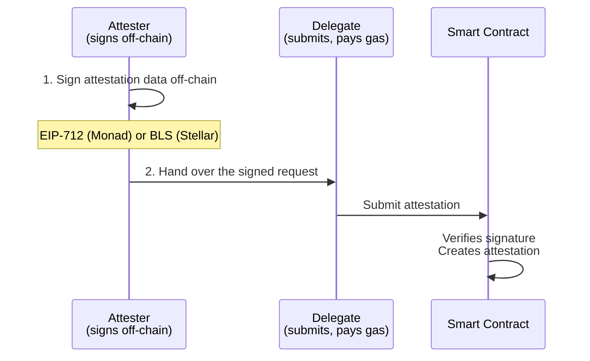
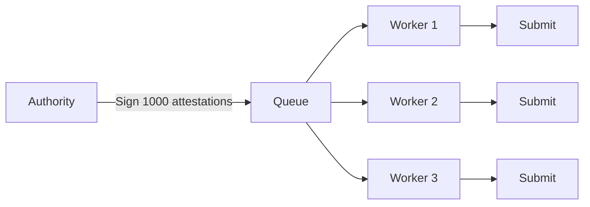

## What are Delegates?

Delegates are addresses authorized to submit attestations on behalf of an attester.
The attester signs attestation data off-chain; the delegate (anyone) submits the
transaction on-chain and pays gas. The signature scheme differs by chain:

| Chain | Scheme | Signed by |
|---|---|---|
| Monad (EVM) | EIP-712 typed-data (ECDSA / secp256k1) | The attester's regular wallet key — no separate keypair |
| Stellar (Soroban) | BLS12-381 | A dedicated BLS keypair, registered on-chain once |



<Note>
The attester can also act as their own delegate — sign, then submit their own
request. Useful for testing the flow, or when you want gas paid from the same
wallet without involving a third party.
</Note>

## Attester vs Subject

When an attestation is created through delegation, two key fields are set:

| Field | Description |
|-------|-------------|
| **attester** | The original signer of the request — not necessarily who submitted the transaction |
| **subject** | The recipient of the attestation — the individual or entity being attested about |

<CodeGroup>
```typescript Monad
// Attester signs off-chain (no gas)
const request = await signet.signDelegatedAttestation({
  schemaUID,
  subject: '0xUser...',   // the person receiving the attestation
  data,                     // ABI-encoded per the schema
})

// Anyone relays it (pays gas)
const { uid } = await signet.submitDelegatedAttestation(request)

// attestation.attester = the signer's address (from `request.attester`)
// attestation.subject  = '0xUser...'
```

```typescript Stellar
// Example: Authority signs, delegate submits
const request = await createDelegatedAttestationRequest({
  schemaUid: Buffer.from('abc123...', 'hex'),
  subject: 'GUSER123...',  // The person receiving the attestation
  data: JSON.stringify({ verified: true })
}, blsPrivateKey, client.getClientInstance());

// When submitted by delegate:
// attestation.attester = 'GDELEGATE...' (who submitted)
// attestation.subject = 'GUSER123...' (who the attestation is about)
```
</CodeGroup>

<Info>
The **subject** always remains the individual or entity the attestation describes, regardless of who submits the transaction.
</Info>

## Why Use Delegates?

### Scalability
Issue thousands of attestations without the authority signing each transaction. The authority pre-signs batches; delegates handle submission.

### Security
Keep authority keys in cold storage or HSMs. Only BLS signatures leave the secure environment, never private keys.

### Cost Efficiency
Delegates pay transaction fees. Authorities don't need to hold tokens for gas.

### Flexibility
Multiple delegates can submit on behalf of one authority. Useful for geographic distribution or redundancy.

## Self-Delegation

An attester can submit their own delegated attestations. This pattern is useful for:

- **Gas management** — the attester pays fees directly from their own wallet
- **Simplicity** — no need to coordinate with separate delegate infrastructure
- **Testing** — validate the delegation flow before involving third parties

<CodeGroup>
```typescript Monad
// Sign as the wallet's own account...
const request = await signet.signDelegatedAttestation({
  schemaUID,
  subject: '0xSubject...',
  data,
})

// ...then submit it with the same client (self as delegate)
const { uid } = await signet.submitDelegatedAttestation(request)

// Result: attester = the signer, subject = 0xSubject...
```

```typescript Stellar
// Authority acts as their own delegate
const authority = new StellarAttestationClient({
  rpcUrl: 'https://soroban-testnet.stellar.org',
  network: 'testnet',
  publicKey: 'GAUTHORITY...'
});

// Sign the request
const request = await createDelegatedAttestationRequest({
  schemaUid: Buffer.from('abc...', 'hex'),
  subject: 'GSUBJECT...',
  data: JSON.stringify({ verified: true })
}, blsPrivateKey, authority.getClientInstance());

// Submit as self (authority is the delegate)
const result = await authority.attestByDelegation(request, {
  signer: authoritySigner
});

// Result: attester = authority, subject = GSUBJECT
```
</CodeGroup>

## EIP-712 Signatures (Monad)

Monad's delegated attestations use [EIP-712](https://eips.ethereum.org/EIPS/eip-712)
typed-data signatures — the same standard behind gasless approvals in most EVM
wallets. No separate keypair or on-chain registration step:

- **No key management** — the attester signs with their existing wallet (`viem`'s
  `walletClient.signTypedData` under the hood); there's nothing extra to generate
  or register on-chain first.
- **Human-readable** — wallets that support EIP-712 (most do) show the attester
  exactly what they're signing, not an opaque hash.
- **Replay-protected** — a per-attester `nonce` and a `deadline` are filled in
  automatically by `signDelegatedAttestation` (override them if you need to).

```typescript
// That's it — no key generation, no registration step
const request = await signet.signDelegatedAttestation({ schemaUID, subject, data })
```

## BLS Keys (Stellar)

Stellar delegation uses BLS12-381 signatures with a separate keypair. BLS offers:

- **Aggregation**: Multiple signatures can be combined into one
- **Deterministic**: Same message + key always produces same signature
- **Compact**: 48-byte signatures (compressed)

### Key Generation

```typescript
import { generateBlsKeys } from '@signetprotocol/stellar-sdk';

const { publicKey, privateKey } = generateBlsKeys();
// publicKey: 192 bytes (uncompressed)
// privateKey: 32 bytes
```

### Key Registration

Before using delegation, register your BLS public key on-chain:

```typescript
await client.registerBlsKey(publicKey, { signer });
```

This links your Stellar address to your BLS public key.

## Delegated Attestation Flow

### 1. Attester: Create and Sign Request

<CodeGroup>
```typescript Monad
// Attester signs off-chain — no gas, no prior registration
const request = await signet.signDelegatedAttestation({
  schemaUID,
  subject: '0xSubject...',
  data,
  expirationTime: BigInt(Math.floor(Date.now() / 1000) + 86400), // 24h
})
```

```typescript Stellar
import { createDelegatedAttestationRequest } from '@signetprotocol/stellar-sdk';

// Authority signs off-chain
const request = await createDelegatedAttestationRequest({
  schemaUid: Buffer.from('abc123...', 'hex'),
  subject: 'GSUBJECT...',
  data: JSON.stringify({ verified: true }),
  expirationTime: Math.floor(Date.now() / 1000) + 86400 // 24h
}, blsPrivateKey, client.getClientInstance());
```
</CodeGroup>

### 2. Delegate: Submit On-chain

<CodeGroup>
```typescript Monad
// Delegate submits the pre-signed request (pays gas)
const { uid } = await signet.submitDelegatedAttestation(request)
```

```typescript Stellar
// Delegate submits the pre-signed request
await client.attestByDelegation(request, { signer: delegateSigner });
```
</CodeGroup>

The contract verifies the signature matches the claimed attester before creating
the attestation — EIP-712 recovery on Monad, a registered BLS key on Stellar.

## Delegated Revocation

Same pattern for revoking attestations:

<CodeGroup>
```typescript Monad
// Attester signs off-chain
const revokeRequest = await signet.signDelegatedRevocation({ attestationUID })

// Delegate submits
const { hash } = await signet.submitDelegatedRevocation(revokeRequest)
```

```typescript Stellar
import { createDelegatedRevocationRequest } from '@signetprotocol/stellar-sdk';

// Authority signs revocation
const revokeRequest = await createDelegatedRevocationRequest({
  attestationUid: Buffer.from('def456...', 'hex')
}, blsPrivateKey, client.getClientInstance());

// Delegate submits
await client.revokeByDelegation(revokeRequest, { signer: delegateSigner });
```
</CodeGroup>

## Security Considerations

### Nonce Management
Each delegation request includes a nonce to prevent replay attacks. The contract tracks used nonces per authority.

### Deadline Enforcement
Requests include a deadline timestamp. Submissions after the deadline are rejected.

### Domain Separation
Different operations (attest, revoke) use different domain separation tags (DST), preventing signature reuse across operations.

## Architecture Patterns

### Batch Issuance
Authority pre-signs many attestations, sends signatures to a queue. Workers pull and submit.



### Event-Driven
Authority runs a signing service. When events occur (user completes KYC), sign and queue for submission.

### Multi-Region
Deploy delegates in multiple regions. Authority in one secure location, delegates distributed globally for lower latency.

## Complete Example

<CodeGroup>
```typescript Monad
import { createPublicClient, createWalletClient, http, encodeAbiParameters } from 'viem'
import { privateKeyToAccount } from 'viem/accounts'
import { SignetClient } from '@signetprotocol/evm-sdk'

const transport = http('https://rpc.ankr.com/monad_testnet')

// Attester — signs off-chain, no gas, no key registration
const attesterAccount = privateKeyToAccount(process.env.ATTESTER_KEY as `0x${string}`)
const attester = new SignetClient({
  chain: 'monadTestnet',
  publicClient: createPublicClient({ transport }),
  walletClient: createWalletClient({ account: attesterAccount, transport }),
})

const data = encodeAbiParameters([{ type: 'bool' }, { type: 'string' }], [true, 'premium'])
const request = await attester.signDelegatedAttestation({
  schemaUID,
  subject: '0xSubject...',
  data,
})

// Delegate — submits on-chain, pays gas (can be a different wallet)
const delegateAccount = privateKeyToAccount(process.env.DELEGATE_KEY as `0x${string}`)
const delegate = new SignetClient({
  chain: 'monadTestnet',
  publicClient: createPublicClient({ transport }),
  walletClient: createWalletClient({ account: delegateAccount, transport }),
})

const { uid } = await delegate.submitDelegatedAttestation(request)
```

```typescript Stellar
import {
  StellarAttestationClient,
  generateBlsKeys,
  createDelegatedAttestationRequest
} from '@signetprotocol/stellar-sdk';

// Setup
const authority = new StellarAttestationClient({
  rpcUrl: 'https://soroban-testnet.stellar.org',
  network: 'testnet',
  publicKey: 'GAUTHORITY...'
});

// One-time: Generate and register BLS keys
const { publicKey, privateKey } = generateBlsKeys();
await authority.registerBlsKey(publicKey, { signer: authoritySigner });

// Authority signs attestation request
const request = await createDelegatedAttestationRequest({
  schemaUid: Buffer.from('abc...', 'hex'),
  subject: 'GSUBJECT...',
  data: JSON.stringify({ verified: true, level: 'premium' })
}, privateKey, authority.getClientInstance());

// Delegate submits (can be different wallet or same as authority)
const delegate = new StellarAttestationClient({
  rpcUrl: 'https://soroban-testnet.stellar.org',
  network: 'testnet',
  publicKey: 'GDELEGATE...'
});

const result = await delegate.attestByDelegation(request, {
  signer: delegateSigner
});
```
</CodeGroup>

## Next Steps

<CardGroup cols={2}>
  <Card title="Authorities" icon="shield" href="/concepts/authorities">
    Schema ownership and trust management
  </Card>
  <Card title="Examples" icon="book" href="/examples/react-integration">
    Real-world integration examples
  </Card>
</CardGroup>
