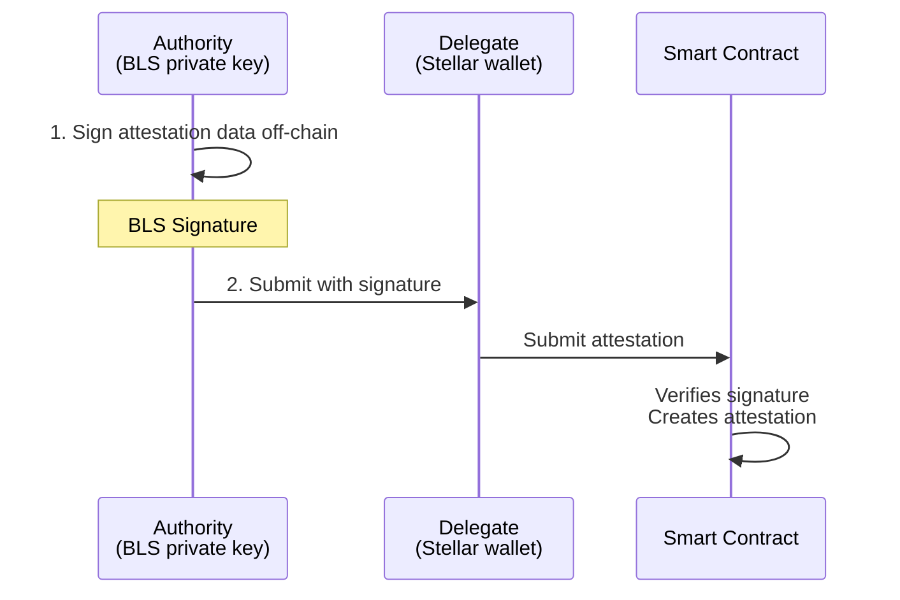
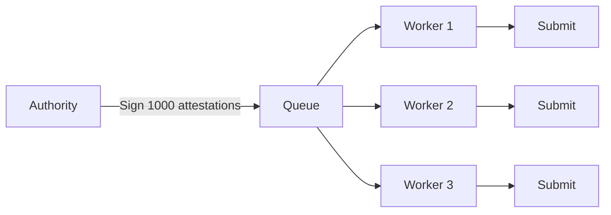

## What are Delegates?

Delegates are addresses authorized to submit attestations on behalf of an authority. The authority signs attestation data off-chain using BLS keys, and the delegate submits the transaction on-chain.



<Note>
The authority can also act as their own delegate. This is useful when you want to use BLS signing for your own submissions, bear gas fees directly, or keep the workflow simple without involving third parties.
</Note>

## Attester vs Subject

When an attestation is created through delegation, two key fields are set:

| Field | Description |
|-------|-------------|
| **attester** | The delegate or authority who submits the transaction on-chain |
| **subject** | The recipient of the attestation — the individual or entity being attested about |

```typescript
// Example: Authority signs, delegate submits
const request = await createDelegatedAttestationRequest({
  schemaUid: Buffer.from('abc123...', 'hex'),
  subject: 'GUSER123...',  // The person receiving the attestation
  data: JSON.stringify({ verified: true })
}, blsPrivateKey, client.getClientInstance());

// When submitted by delegate:
// attestation.attester = 'GDELEGATE...' (who submitted)
// attestation.subject = 'GUSER123...' (who the attestation is about)
```

<Info>
The **subject** always remains the individual or entity the attestation describes, regardless of who submits the transaction.
</Info>

## Why Use Delegates?

### Scalability
Issue thousands of attestations without the authority signing each transaction. The authority pre-signs batches; delegates handle submission.

### Security
Keep authority keys in cold storage or HSMs. Only BLS signatures leave the secure environment, never private keys.

### Cost Efficiency
Delegates pay transaction fees. Authorities don't need to hold tokens for gas.

### Flexibility
Multiple delegates can submit on behalf of one authority. Useful for geographic distribution or redundancy.

## Self-Delegation

An authority can submit their own delegated attestations. This pattern is useful for:

- **Gas management** — Authority pays fees directly from their wallet
- **Simplicity** — No need to coordinate with separate delegate infrastructure
- **Testing** — Validate the delegation flow before involving third parties

```typescript
// Authority acts as their own delegate
const authority = new StellarAttestationClient({
  rpcUrl: 'https://soroban-testnet.stellar.org',
  network: 'testnet',
  publicKey: 'GAUTHORITY...'
});

// Sign the request
const request = await createDelegatedAttestationRequest({
  schemaUid: Buffer.from('abc...', 'hex'),
  subject: 'GSUBJECT...',
  data: JSON.stringify({ verified: true })
}, blsPrivateKey, authority.getClientInstance());

// Submit as self (authority is the delegate)
const result = await authority.attestByDelegation(request, {
  signer: authoritySigner
});

// Result: attester = authority, subject = GSUBJECT
```

## BLS Keys

SignetProtocol uses BLS12-381 signatures for delegation. BLS offers:

- **Aggregation**: Multiple signatures can be combined into one
- **Deterministic**: Same message + key always produces same signature
- **Compact**: 48-byte signatures (compressed)

### Key Generation

```typescript
import { generateBlsKeys } from '@signetprotocol/stellar-sdk';

const { publicKey, privateKey } = generateBlsKeys();
// publicKey: 192 bytes (uncompressed)
// privateKey: 32 bytes
```

### Key Registration

Before using delegation, register your BLS public key on-chain:

```typescript
await client.registerBlsKey(publicKey, { signer });
```

This links your Stellar address to your BLS public key.

## Delegated Attestation Flow

### 1. Authority: Create and Sign Request

```typescript
import { createDelegatedAttestationRequest } from '@signetprotocol/stellar-sdk';

// Authority signs off-chain
const request = await createDelegatedAttestationRequest({
  schemaUid: Buffer.from('abc123...', 'hex'),
  subject: 'GSUBJECT...',
  data: JSON.stringify({ verified: true }),
  expirationTime: Math.floor(Date.now() / 1000) + 86400 // 24h
}, blsPrivateKey, client.getClientInstance());
```

### 2. Delegate: Submit On-chain

```typescript
// Delegate submits the pre-signed request
await client.attestByDelegation(request, { signer: delegateSigner });
```

The contract verifies the BLS signature matches the registered authority before creating the attestation.

## Delegated Revocation

Same pattern for revoking attestations:

```typescript
import { createDelegatedRevocationRequest } from '@signetprotocol/stellar-sdk';

// Authority signs revocation
const revokeRequest = await createDelegatedRevocationRequest({
  attestationUid: Buffer.from('def456...', 'hex')
}, blsPrivateKey, client.getClientInstance());

// Delegate submits
await client.revokeByDelegation(revokeRequest, { signer: delegateSigner });
```

## Security Considerations

### Nonce Management
Each delegation request includes a nonce to prevent replay attacks. The contract tracks used nonces per authority.

### Deadline Enforcement
Requests include a deadline timestamp. Submissions after the deadline are rejected.

### Domain Separation
Different operations (attest, revoke) use different domain separation tags (DST), preventing signature reuse across operations.

## Architecture Patterns

### Batch Issuance
Authority pre-signs many attestations, sends signatures to a queue. Workers pull and submit.



### Event-Driven
Authority runs a signing service. When events occur (user completes KYC), sign and queue for submission.

### Multi-Region
Deploy delegates in multiple regions. Authority in one secure location, delegates distributed globally for lower latency.

## Complete Example

```typescript
import {
  StellarAttestationClient,
  generateBlsKeys,
  createDelegatedAttestationRequest
} from '@signetprotocol/stellar-sdk';

// Setup
const authority = new StellarAttestationClient({
  rpcUrl: 'https://soroban-testnet.stellar.org',
  network: 'testnet',
  publicKey: 'GAUTHORITY...'
});

// One-time: Generate and register BLS keys
const { publicKey, privateKey } = generateBlsKeys();
await authority.registerBlsKey(publicKey, { signer: authoritySigner });

// Authority signs attestation request
const request = await createDelegatedAttestationRequest({
  schemaUid: Buffer.from('abc...', 'hex'),
  subject: 'GSUBJECT...',
  data: JSON.stringify({ verified: true, level: 'premium' })
}, privateKey, authority.getClientInstance());

// Delegate submits (can be different wallet or same as authority)
const delegate = new StellarAttestationClient({
  rpcUrl: 'https://soroban-testnet.stellar.org',
  network: 'testnet',
  publicKey: 'GDELEGATE...'
});

const result = await delegate.attestByDelegation(request, {
  signer: delegateSigner
});
```

## Next Steps

<CardGroup cols={2}>
  <Card title="Authorities" icon="shield" href="/concepts/authorities">
    Schema ownership and trust management
  </Card>
  <Card title="Examples" icon="book" href="/examples/react-integration">
    Real-world integration examples
  </Card>
</CardGroup>
