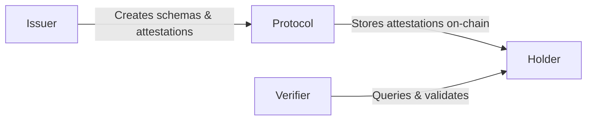

## Four Actors

**Issuer**: Creates schemas and issues attestations (e.g., a KYC provider)

**Protocol**: The on-chain registry contracts storing schemas and attestations

**Holder**: The subject an attestation is about

**Verifier**: Queries and validates attestations — needs no permission and no API key

## Attestation Flow

1. **Schema Creation** — anyone registers a schema; the registrant becomes its
   authority. No stake or approval required — schema creation is permissionless by
   default.
2. **Attestation** — an issuer creates a signed claim about a subject, referencing a
   schema.
3. **Storage** — the protocol stores the attestation on-chain and computes its
   deterministic UID.
4. **Verification** — anyone reads and verifies it directly against the contract;
   Signet's indexer (Horizon) makes querying easier but isn't required to trust the
   result.

## Key Features

### Delegation

Sign an attestation off-chain, have someone else submit it on-chain — the submitter
pays gas, not the attester. The signature scheme differs by chain:

| Chain | Delegation scheme |
| --- | --- |
| Monad (EVM) | EIP-712 typed-data signatures (ECDSA / secp256k1) |
| Stellar (Soroban) | BLS12-381 signatures |

### Resolvers

An optional contract a schema points at to add validation before an attestation is
stored — fees, allowlists, rate limits, or custom rules. No resolver means fully
permissionless attestation.

### Immutability

No admin key upgrades the registries. All policy lives in resolver contracts that
anyone can deploy and any schema can point at.

## Chain-Specific Details

<CardGroup cols={2}>
  <Card title="Monad" icon="rocket" href="/monad/overview">
    EVM, passkey personhood, EIP-712 delegation, live contract addresses.
  </Card>
  <Card title="Stellar" icon="star" href="/chains/stellar/overview">
    Soroban, BLS delegation, live contract addresses.
  </Card>
</CardGroup>

## Next Steps

<CardGroup cols={2}>
  <Card title="Monad Quickstart" icon="rocket" href="/monad/quickstart">
    Create your first attestation
  </Card>
  <Card title="Schemas" icon="cube" href="/concepts/schemas">
    Learn about schema design
  </Card>
</CardGroup>
