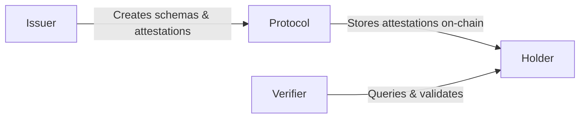

## Four Actors

**Issuer**: Creates schemas and issues attestations (e.g., KYC provider)

**Protocol**: On-chain smart contract storing attestations

**Holder**: Receives attestations linked to their address

**Verifier**: Queries and validates attestations

## Attestation Flow

1. **Schema Creation** - Issuer defines data structure
2. **Attestation** - Issuer creates signed claim about a subject
3. **Storage** - Protocol stores attestation on-chain
4. **Verification** - Anyone can query and verify

## Key Features

### BLS Delegation
Sign attestations off-chain, submit on-chain. The submitter pays gas, not the attester.

### Economic Security
Authority registration requires stake, preventing Sybil attacks.

### Resolvers
Optional validation logic before attestations are stored (e.g., payment verification).

## Contract Architecture

**Protocol Contract**: Core attestation engine
- Schema registration
- Attestation creation/revocation
- BLS signature verification

**Authority Contract**: Trust management
- Authority registration with payment
- Resolver interface for custom validation

## Next Steps

<CardGroup cols={2}>
  <Card title="Quickstart" icon="rocket" href="/quickstart">
    Create your first attestation
  </Card>
  <Card title="Schemas" icon="cube" href="/concepts/schemas">
    Learn about schema design
  </Card>
</CardGroup>
