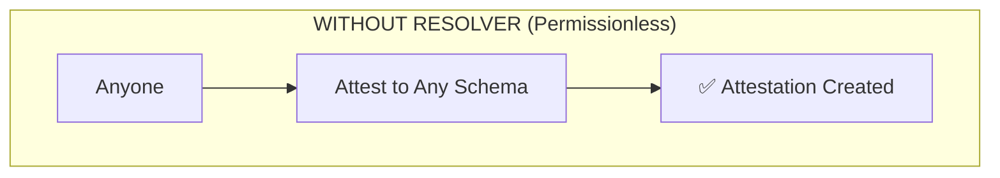
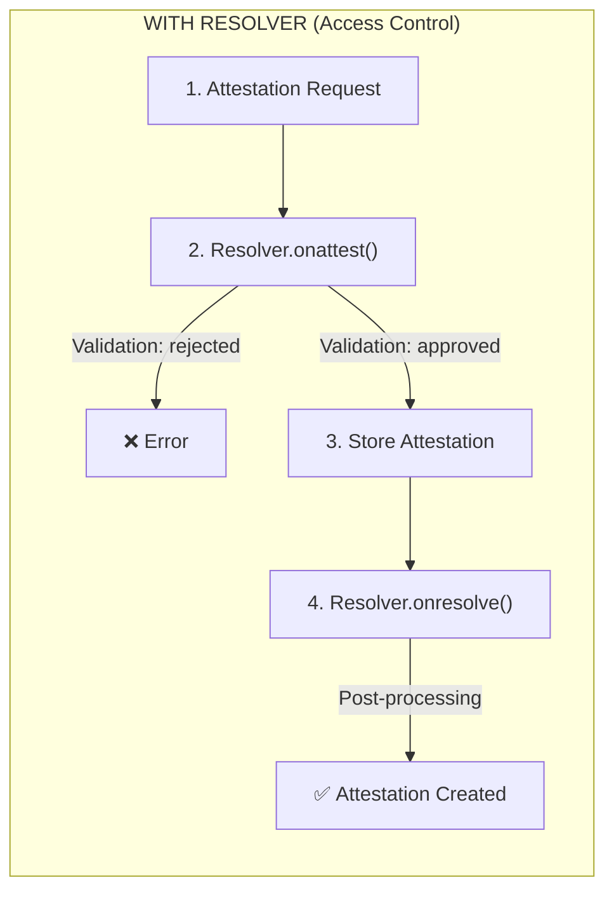

## What are Resolvers?

Resolvers are smart contracts that define **custom validation rules** for attestations. When you attach a resolver to a schema, every attestation must pass through the resolver's validation logic before being created.

<Note>
Schemas and attestations are **permissionless by default**. Resolvers are how you add access control, fees, or custom rules when you need them.
</Note>

## Why Use Resolvers?

By default, **anyone can attest to any schema**. This permissionless model is intentional — it enables open, composable attestations. But sometimes you need control:

Resolvers let you:

- **Control access** — Only allow specific addresses to attest
- **Collect fees** — Require payment before attestation creation
- **Distribute rewards** — Incentivize attestation with token rewards
- **Enforce rules** — Implement custom business logic





## Resolver Interface

All resolvers implement the same interface, making them pluggable and interchangeable:

```rust
pub trait ResolverInterface {
    // Validate before attestation creation
    fn onattest(env: Env, attestation: ResolverAttestationData) -> Result<bool, ResolverError>;

    // Validate before attestation revocation
    fn onrevoke(env: Env, attestation: ResolverAttestationData) -> Result<bool, ResolverError>;

    // Post-processing callback (after creation/revocation)
    fn onresolve(env: Env, attestation_uid: BytesN<32>, attester: Address) -> Result<(), ResolverError>;

    // Resolver metadata for discovery
    fn metadata(env: Env) -> ResolverMetadata;
}
```

### Hook Functions

| Function | When Called | Purpose | Critical? |
|----------|-------------|---------|-----------|
| `onattest` | Before attestation creation | Validate and gate access | Yes |
| `onrevoke` | Before attestation revocation | Validate revocation permission | Yes |
| `onresolve` | After creation/revocation | Post-processing (rewards, cleanup) | No |
| `metadata` | On query | Return resolver information | No |

<Warning>
**Critical vs Non-Critical:** If `onattest` or `onrevoke` fails, the operation is aborted. If `onresolve` fails, the attestation still succeeds — it's for side effects only.
</Warning>

## Attestation Data

Resolvers receive complete attestation data for validation:

```rust
pub struct ResolverAttestationData {
    pub uid: BytesN<32>,           // Unique attestation ID
    pub schema_uid: BytesN<32>,    // Associated schema
    pub recipient: Address,        // Who is being attested about
    pub attester: Address,         // Who is attesting
    pub time: u64,                 // Creation timestamp
    pub expiration_time: u64,      // When it expires (0 = never)
    pub revocation_time: u64,      // When revoked (0 = not revoked)
    pub revocable: bool,           // Can be revoked?
    pub ref_uid: Bytes,            // Reference to another attestation
    pub data: Bytes,               // Encoded attestation data
    pub value: i128,               // Optional payment value
}
```

## Resolver Types

### Default Resolver

The simplest resolver — validates basic rules without economic requirements.

```rust
impl ResolverInterface for DefaultResolver {
    fn onattest(env: Env, attestation: ResolverAttestationData) -> Result<bool, ResolverError> {
        // Require attester authorization
        attestation.attester.require_auth();

        // Prevent self-attestation
        if attestation.attester == attestation.recipient {
            return Err(ResolverError::ValidationFailed);
        }

        // Validate expiration
        if attestation.expiration_time > 0
            && attestation.expiration_time < env.ledger().timestamp() {
            return Err(ResolverError::InvalidAttestation);
        }

        Ok(true)
    }
}
```

**Use cases:**
- Development and testing
- Schemas without special requirements
- Base implementation for custom resolvers

### Fee Collection Resolver

Requires payment before attestation creation.

```rust
impl ResolverInterface for FeeCollectionResolver {
    fn onattest(env: Env, attestation: ResolverAttestationData) -> Result<bool, ResolverError> {
        attestation.attester.require_auth();

        // Check payment amount
        let required_fee = get_attestation_fee(&env);
        if attestation.value < required_fee {
            return Err(ResolverError::InsufficientFunds);
        }

        // Collect the fee
        collect_fee(&env, &attestation.attester, attestation.value)?;

        Ok(true)
    }
}
```

**Use cases:**
- Monetizing attestation services
- Spam prevention through economic cost
- Revenue generation for attestation providers

### Token Reward Resolver

Distributes token rewards for attestation creation.

```rust
impl ResolverInterface for TokenRewardResolver {
    fn onattest(_env: Env, _attestation: ResolverAttestationData) -> Result<bool, ResolverError> {
        // Permissionless - gas cost provides spam resistance
        Ok(true)
    }

    fn onresolve(env: Env, _attestation_uid: BytesN<32>, attester: Address) -> Result<(), ResolverError> {
        // Distribute reward after attestation
        let reward_amount = get_reward_amount(&env);
        distribute_reward(&env, &attester, reward_amount)?;
        Ok(())
    }
}
```

**Use cases:**
- Incentivizing attestation creation
- Community engagement programs
- Protocol growth mechanics

### Authority Resolver

Permission-based access control with verification.

```rust
impl ResolverInterface for AuthorityResolver {
    fn onattest(env: Env, attestation: ResolverAttestationData) -> Result<bool, ResolverError> {
        attestation.attester.require_auth();

        // Check if attester is a registered authority
        if !is_registered_authority(&env, &attestation.attester) {
            return Err(ResolverError::NotAuthorized);
        }

        Ok(true)
    }
}
```

**Use cases:**
- Restricted attestation environments
- Verified issuer programs
- Credentialed attestation systems

## Creating a Custom Resolver

### Step 1: Implement the Interface

```rust
use soroban_sdk::{contract, contractimpl, Env, Address, BytesN, String};
use resolvers::{ResolverInterface, ResolverAttestationData, ResolverError, ResolverMetadata, ResolverType};

#[contract]
pub struct MyCustomResolver;

#[contractimpl]
impl ResolverInterface for MyCustomResolver {
    fn onattest(env: Env, attestation: ResolverAttestationData) -> Result<bool, ResolverError> {
        // Your validation logic here
        attestation.attester.require_auth();

        // Example: Only allow attestations on weekdays
        // (This is just an example - implement your own logic)

        Ok(true)
    }

    fn onrevoke(env: Env, attestation: ResolverAttestationData) -> Result<bool, ResolverError> {
        attestation.attester.require_auth();

        if !attestation.revocable {
            return Err(ResolverError::ValidationFailed);
        }

        Ok(true)
    }

    fn onresolve(_env: Env, _attestation_uid: BytesN<32>, _attester: Address) -> Result<(), ResolverError> {
        // Optional post-processing
        Ok(())
    }

    fn metadata(env: Env) -> ResolverMetadata {
        ResolverMetadata {
            name: String::from_str(&env, "My Custom Resolver"),
            version: String::from_str(&env, "1.0.0"),
            description: String::from_str(&env, "Custom validation for my use case"),
            resolver_type: ResolverType::Custom,
        }
    }
}
```

### Step 2: Build the Contract

```bash
cargo build --target wasm32v1-none --release
```

### Step 3: Deploy to Stellar

```bash
stellar contract deploy \
  --wasm target/wasm32v1-none/release/my_resolver.wasm \
  --source YOUR_IDENTITY \
  --network testnet
```

### Step 4: Attach to a Schema

```typescript
const schemaUid = await client.createSchema({
  definition: 'string credential, uint64 issuedAt',
  resolver: 'CRESOLVER...', // Your deployed resolver address
  revocable: true
});
```

## Binding Resolvers to Schemas

When you create a schema, you can optionally attach a resolver:

```typescript
import { StellarAttestationClient } from '@signetprotocol/stellar-sdk';

const client = new StellarAttestationClient({ network: 'testnet' });

// Schema with a resolver
const schemaWithResolver = await client.createSchema({
  definition: 'string credential, bool verified',
  resolver: 'CRESOLVER...', // Resolver contract address
  revocable: true
});

// Schema without a resolver (permissionless - anyone can attest)
const schemaWithoutResolver = await client.createSchema({
  definition: 'string note',
  resolver: null, // No resolver = anyone can attest
  revocable: false
});
```

<Info>
Once a schema is created, its resolver cannot be changed. Choose your resolver carefully before deploying to production.
</Info>

## Error Handling

Resolvers use a standard error enum:

```rust
#[contracterror]
pub enum ResolverError {
    NotAuthorized = 1,      // Caller lacks permission
    InvalidAttestation = 2, // Attestation data is invalid
    InvalidSchema = 3,      // Schema mismatch
    InsufficientFunds = 4,  // Payment too low
    TokenTransferFailed = 5,// Token operation failed
    StakeRequired = 6,      // Staking requirement not met
    ValidationFailed = 7,   // Generic validation failure
    CustomError = 8,        // Custom error condition
}
```

## Security Considerations

<Warning>
Resolver bugs can lead to unauthorized attestations or denial of service. Test thoroughly before production deployment.
</Warning>

### Best Practices

1. **Always require auth** — Call `require_auth()` on the attester
2. **Validate all inputs** — Don't trust data from the protocol
3. **Handle failures gracefully** — Return proper error codes
4. **Avoid state dependencies** — Don't rely on external state that can be manipulated
5. **Test edge cases** — Expired attestations, revocations, etc.

### Common Pitfalls

| Pitfall | Issue | Solution |
|---------|-------|----------|
| Missing auth check | Anyone can attest | Always call `require_auth()` |
| Self-attestation | Users attest to themselves | Check `attester != recipient` |
| Expired data | Using outdated timestamps | Validate against current time |
| Reentrancy | Token callbacks | Use checks-effects-interactions pattern |

## Testing Resolvers

```rust
#[test]
fn test_reject_self_attestation() {
    let (env, resolver) = setup();
    let user = Address::generate(&env);

    let attestation = build_attestation(&env, &user, &user, 0);

    let result = resolver.try_onattest(&attestation);
    assert!(matches!(result.err(), Some(Ok(ResolverError::ValidationFailed))));
}

#[test]
fn test_accept_valid_attestation() {
    let (env, resolver) = setup();
    let attester = Address::generate(&env);
    let recipient = Address::generate(&env);

    let attestation = build_attestation(&env, &attester, &recipient, 0);

    assert!(resolver.onattest(&attestation));
}
```

## Built-in Resolvers

The protocol provides pre-built resolvers you can use:

| Resolver | Purpose | Build Command |
|----------|---------|---------------|
| Default | Basic validation | `--features export-default-resolver` |
| Token Reward | Distribute rewards | `--features export-token-reward-resolver` |
| Fee Collection | Collect fees | `--features export-fee-collection-resolver` |

```bash
# Build the default resolver
cargo build --target wasm32v1-none --release --features export-default-resolver

# Deploy
stellar contract deploy \
  --wasm target/wasm32v1-none/release/resolvers.wasm \
  --source YOUR_IDENTITY \
  --network testnet
```

## Next Steps

<CardGroup cols={2}>
  <Card title="Authorities" icon="shield" href="/concepts/authorities">
    Understand the trust layer for attestation issuers
  </Card>
  <Card title="Schemas" icon="database" href="/concepts/schemas">
    Define attestation structures with resolver bindings
  </Card>
  <Card title="Stellar Overview" icon="star" href="/chains/stellar/overview">
    Deep dive into Stellar contract architecture
  </Card>
  <Card title="GitHub" icon="github" href="https://github.com/robertocarlous/Signet/tree/main/contracts/stellar/resolvers">
    Browse resolver source code
  </Card>
</CardGroup>
