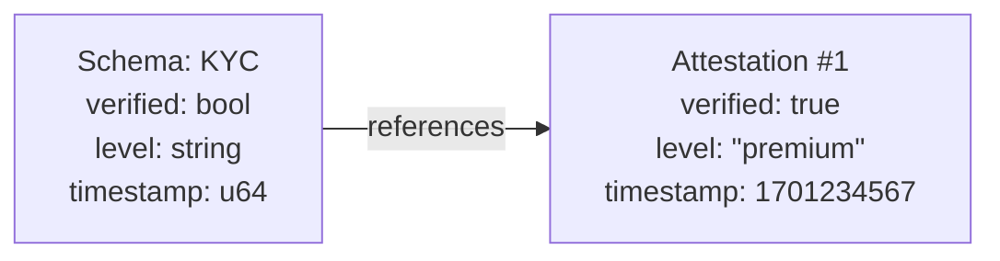

## What is a Schema?

A schema is a template that defines what data an attestation contains. Every attestation references a schema, ensuring data consistency and enabling verification.



## Why Schemas Matter

### Data Consistency
Schemas enforce structure. An attestation using a KYC schema will always have the same fields, making it predictable for verifiers.

### Interoperability
Different applications can issue attestations against the same schema. A "KYC verified" attestation from Provider A is structurally identical to one from Provider B.

### Discoverability
Schemas are registered on-chain with unique identifiers. Applications can query for all attestations of a specific type.

## Schema Components

| Component | Description |
|-----------|-------------|
| **Definition** | Field names and types |
| **Authority** | Who created the schema |
| **Resolver** | Optional contract for custom validation |
| **Revocable** | Whether attestations can be revoked |
| **UID** | Deterministic identifier |

## Field Types

Schemas support these primitive types:

| Type | Size | Description |
|------|------|-------------|
| `bool` | 1 bit | True/false |
| `string` | Variable | Text data |
| `u32` | 32 bits | Unsigned integer |
| `u64` | 64 bits | Unsigned integer (timestamps) |
| `i32` | 32 bits | Signed integer |
| `i64` | 64 bits | Signed integer |
| `i128` | 128 bits | Large signed integer |
| `bytes` | Variable | Binary data |
| `address` | 56 chars | Stellar wallet address |
| `symbol` | Variable | Soroban symbol type |
| `timestamp` | 64 bits | Unix timestamp |
| `amount` | Variable | Token amounts |

## Encoding Formats

The SDK's `SorobanSchemaEncoder` supports multiple encoding formats. Your choice of format affects how data is stored and indexed.

<Note>
These encoding formats determine how your schema and attestation data are stored on-chain and indexed by our explorer. Choose the format that best fits your use case.
</Note>

### Typed Schema (Default)

Native typed schema with validation rules. Best for most use cases.

```typescript
import { SorobanSchemaEncoder, StellarDataType } from '@signetprotocol/stellar-sdk';

const encoder = new SorobanSchemaEncoder({
  name: 'KYC',
  description: 'Know Your Customer verification',
  fields: [
    { name: 'verified', type: StellarDataType.BOOL },
    { name: 'level', type: StellarDataType.STRING, validation: { enum: ['basic', 'enhanced', 'premium'] } },
    { name: 'verifiedAt', type: StellarDataType.TIMESTAMP },
    { name: 'subject', type: StellarDataType.ADDRESS }
  ]
});

// Encode attestation data with validation
const encoded = await encoder.encodeData({
  verified: true,
  level: 'premium',
  verifiedAt: Date.now(),
  subject: 'GUSER...'
});
```

**Features:**
- Type validation at encode time
- Optional field validation (min, max, pattern, enum)
- Auto-conversion for timestamps and addresses

### JSON Schema

Standard JSON Schema format for interoperability with external tools.

```typescript
// Convert typed schema to JSON Schema
const jsonSchema = encoder.toJSONSchema();

// Create encoder from existing JSON Schema
const fromJson = SorobanSchemaEncoder.fromJSONSchema({
  title: 'EventAttendance',
  type: 'object',
  properties: {
    eventId: { type: 'string' },
    attended: { type: 'boolean' },
    timestamp: { type: 'number' }
  },
  required: ['eventId', 'attended']
});
```

**Use cases:**
- Integration with JSON Schema validators
- Generating forms from schemas
- API documentation and OpenAPI specs

### XDR Format

Stellar's native binary format for efficient storage and **selective disclosure**.

```typescript
// Encode schema to XDR
const xdrString = encoder.toXDR();
// Returns: "XDR:AAAA..." (base64-encoded binary)

// Decode XDR back to schema
const decoded = SorobanSchemaEncoder.fromXDR(xdrString);
```

**Benefits:**
- **Compact storage** — Binary format reduces on-chain storage costs
- **Selective disclosure** — Reveal only specific fields without exposing entire attestation
- **Native Soroban compatibility** — Direct integration with contract data structures

<Info>
XDR provides selective disclosure, not encryption. Data is structured so you can reveal individual fields while keeping others private. For true privacy, combine with off-chain encrypted storage.
</Info>

### Format Comparison

| Format | Storage Size | Indexer Support | Use Case |
|--------|--------------|-----------------|----------|
| **Typed** | Medium | Full | General purpose, validation needed |
| **JSON** | Larger | Full | Interoperability, external tools |
| **XDR** | Smallest | Full | Compact storage, selective disclosure |

<Warning>
All three formats are fully supported by the SignetProtocol indexer and explorer. Your attestation data will be queryable regardless of encoding choice.
</Warning>

## Schema UID

Every schema has a unique identifier derived from:

```
UID = hash(definition + authority + resolver)
```

This means:
- Same definition by different authorities = different UIDs
- Same authority, different definition = different UIDs
- Identical inputs always produce the same UID

## Resolvers

A resolver is an optional smart contract that validates attestations before they're created. Use cases:

- **Payment gates**: Require fee payment before attestation
- **Eligibility checks**: Verify the subject meets criteria
- **Rate limiting**: Prevent spam attestations
- **Custom logic**: Any business rules

## Common Schema Patterns

### Identity Verification
```
verified: bool
level: string        // "basic", "enhanced", "premium"
provider: string     // "plaid", "jumio", etc.
expiry: u64
```

### Credential
```
title: string        // "AWS Solutions Architect"
issuer: string       // "Amazon Web Services"
issuedAt: u64
expiresAt: u64
```

### Membership
```
organization: string
role: string
joinedAt: u64
active: bool
```

### Reputation
```
score: u32
category: string     // "trustworthiness", "expertise"
updatedAt: u64
```

## Schema Lifecycle

1. **Create**: Authority registers schema on-chain
2. **Discover**: Others find schema by UID or query
3. **Use**: Attesters create attestations referencing schema
4. **Verify**: Verifiers decode attestation data using schema definition

## Best Practices

<CardGroup cols={2}>
  <Card title="Keep schemas minimal">
    Only include fields you need. Smaller schemas = lower costs.
  </Card>
  <Card title="Use appropriate types">
    `u64` for timestamps, `bool` for flags, `string` for text.
  </Card>
  <Card title="Plan for revocation">
    Set `revocable: true` for credentials that may need invalidation.
  </Card>
  <Card title="Version your schemas">
    Include version in name: `KYC_v2` for breaking changes.
  </Card>
</CardGroup>

## Next Steps

<CardGroup cols={2}>
  <Card title="Create a Schema" icon="plus" href="/stellar/schemas">
    Step-by-step guide for Stellar
  </Card>
  <Card title="SDK Reference" icon="code" href="/stellar/reference">
    Complete API documentation
  </Card>
</CardGroup>
